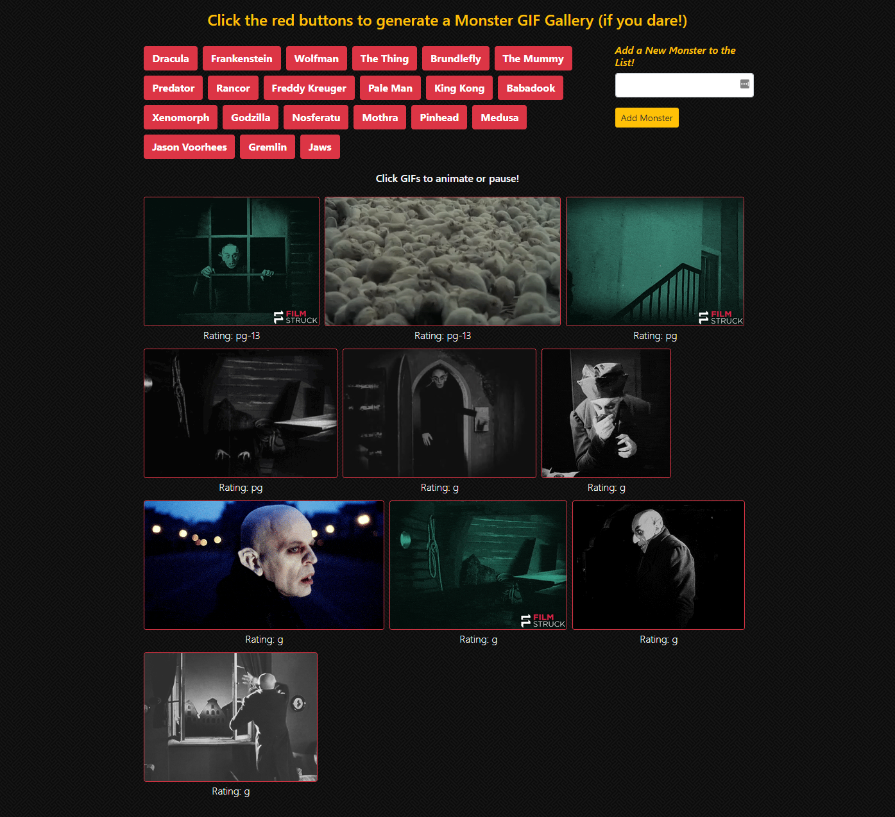

# Monster GIF Gallery
## UNC Coding Bootcamp API Homework #6  10-15-2018

This assignment dynamically creates a gallery of monster-themed GIFS by sending an AJAX request to the GIPHY API and putting the first 10 results on the webpage. The user can call up the GIFS by clicking on one of the preset "monster" buttons, or by adding their own keyword and then clicking on that.  he GIFS are still images by default, but they can be animated or paused on click.

This app uses the following tools:
* HTML
* Bootstrap for layout, responsiveness, and basic styling
* CSS for additional styling
* Javascript for app logic, collecting user input, and writing to the DOM
* jQuery for Javascript library and AJAX requests
* GIPHY API for GIF search

My deployed app can be viewed here: https://zinc-glaze.github.io/MonsterGIFs/

### Screenshot

Future development of this app will add some of the following features:

* Fully mobile responsive.
* Allow users to request additional gifs to be added to the page. Each request should ADD 10 gifs to the page, NOT overwrite the existing gifs.
* Include a 1-click download button for each gif, this should work across device types.
* Allow users to add their favorite gifs to a `favorites` section. This should persist even when they select or add a new topic. Look into making this section persist even when the page is reloaded(via localStorage or cookies).
